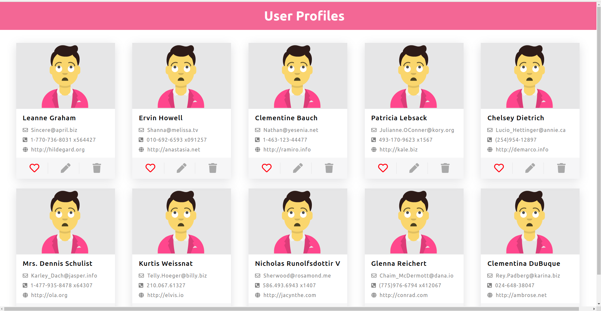
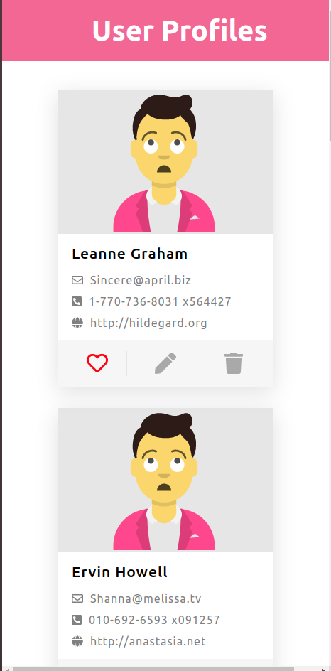

# User data fetching from api and display their profile
This project basically contains the profiles of various users which are displayed in the form of cards.The data related to the cards are obtained from API. 
  
## demo images 

## Available Scripts

In the project directory, you can run:
### `npm install`
### `npm start`

Runs the app in the development mode.\
Open [http://localhost:3000](http://localhost:3000) to view it in the browser.

